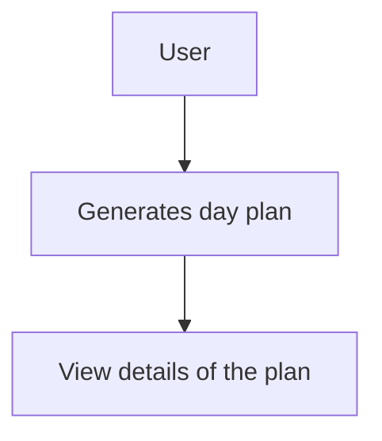
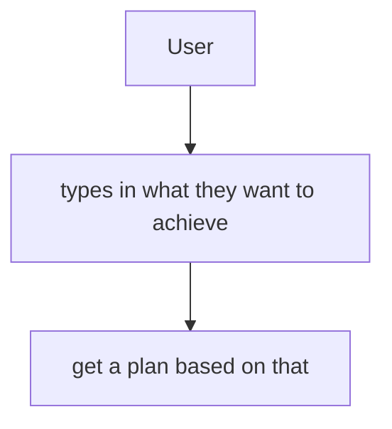
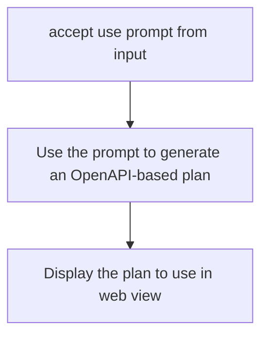
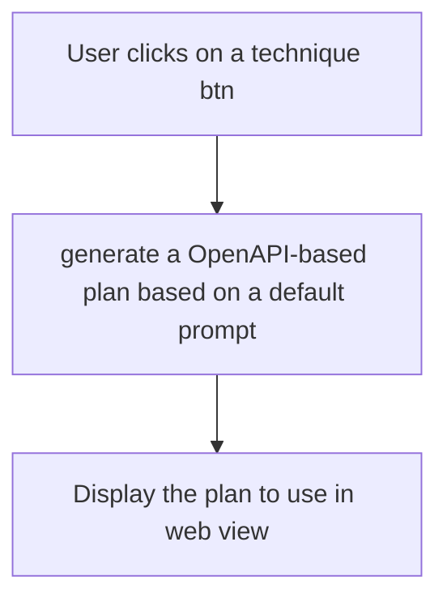

## Overview

This app allows users to generate a day/task plan based on AI using established productivity techniques.

## User Journey

How will how user interact and use this app? What problem am I helping this use solve AND how am I doing it?

## Application Architecture

Designing the algorithm for our code, problem

### Use case 1:

### Use case 2:

